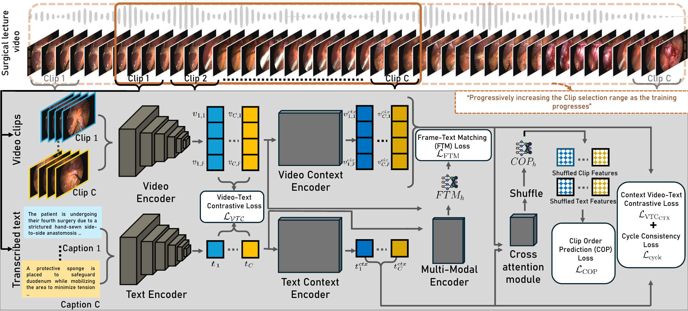

<div align="center">

# CliPPER: Contextual Video-Language Pretraining on Long-form Intraoperative Surgical Procedures for Event Recognition

**[Florian Philipp Stilz](https://example.com)**<sup>1,2,3</sup> · **[Vinkle Srivastav](https://example.com)**<sup>1,2</sup> · **[Nassir Navab](https://example.com)**<sup>3</sup> · **[Nicolas Padoy](https://example.com)**<sup>1,2</sup>

<sup>1</sup>University of Strasbourg, CNRS, INSERM, ICube, UMR7357, France &nbsp;&nbsp;&nbsp; <sup>2</sup>IHU Strasbourg, France &nbsp;&nbsp;&nbsp; <sup>3</sup>Technical University of Munich, Germany

[](#)
[](#)
[](#)

</div>

---

## 💡 Motivation
Surgical procedures are long, complex, and visually subtle, yet a large fraction of intraoperative errors are preventable, highlighting the critical need for automated surgical understanding. Manual annotation of surgical videos is time-consuming, requires expert knowledge, and is inherently limited, creating a data-sparse environment where traditional supervised approaches struggle. Foundation models, particularly video–language pretraining frameworks, offer a promising solution by leveraging large-scale video–text pairs to learn transferable representations even under limited supervision. However, existing models often fail to capture long-term procedural context and fine-grained frame-to-text alignment, which are essential for accurately modeling the temporal structure, repeated phases, and subtle semantic cues in surgical workflows. Developing specialized foundation models that integrate context-aware video–text alignment can therefore unlock robust, scalable understanding of complex surgical procedures without relying on extensive manual annotations.

## ⚙️ Method
**CliPPER** is a context-aware video–language pretraining framework designed for long-form surgical videos, combining dual-encoder contrastive learning with temporal and fine-grained supervision. Each video is split into multiple clips processed independently through a Video Encoder (BEiT) and a Text Encoder (BERT), producing frame-level and text embeddings that are then enhanced by separate context encoders to capture intra-video dependencies. The model is trained using a context-aware video-text contrastive loss to align clips with textual descriptions while modeling extended procedural context, a cycle-consistency alignment loss to reduce many-to-one ambiguities, and Clip Order Prediction (COP) to enforce temporal reasoning. Additionally, a Multi-Modal Encoder fuses visual and textual features to perform Frame–Text Matching (FTM), enabling fine-grained alignment of individual frames with textual tokens. Together, these objectives allow CliPPER to learn rich, temporally-aware, and semantically precise video–language representations suitable for complex surgical understanding tasks.



## 📊 Results

We evaluate **CliPPER** thoroughly on multiple downstream tasks in a **zero-shot** setting, demonstrating significant improvements over existing Vision-Language Models (VLMs) and surgical-specific baselines. 

### Zero-shot Surgical Workflow Recognition
We perform zero-shot surgical phase recognition on four diverse public datasets: Cholec80, AutoLaparo, MultiBypass140, and GraSP. CliPPER significantly outperforms previous state-of-the-art methods, showing robust generalization across different surgical procedures.

**Table 1: Zero-shot Surgical Phase Recognition (F1-Score)**

| Model | Cholec80 | AutoLaparo | StrasBypass70 | BernBypass70 | GraSP | Average |
|-------|:---:|:---:|:---:|:---:|:---:|:---:|
| VindLU | 8.2 | 7.7 | 2.5 | 2.6 | 2.8 | 4.7 |
| SurgVLP | 23.3 | 10.8 | 14.1 | 7.8 | 7.6 | 12.7 |
| PeskaVLP | 30.5 | 25.4 | 26.5 | 19.2 | 7.7 | 21.8 |
| VindLU-SVL | 29.3 | 17.9 | 31.5 | 18.3 | 14.9 | 22.4 |
| **Ours-SVL** | 30.6 | 31.8 | 34.8 | 21.7 | 16.9 | 27.2 |
| **Ours-YT** | 34.9 | **50.0** | 30.3 | 18.1 | 33.3 | 33.3 |
| **Ours-All** | **38.3** | 49.4 | **37.9** | **24.1** | **34.1** | **36.8** |

*Pretraining on our full combined dataset (Ours-All) yields an absolute improvement of +14.4% (+64.3% relative) over the strongest baseline (VindLU-SVL).*

### Zero-shot Activity Triplet & Instrument Recognition
To test finer-grained understanding, we evaluate activity triplet (*ivt*) and instrument (*i*) recognition on the CholecT50 and ProstaTD datasets.

**Table 2: Zero-shot Triplet and Instrument Recognition (mAP %)**

| Model | CholecT50 (*ivt*) | CholecT50 (*i*) | ProstaTD (*ivt*) | ProstaTD (*i*) | Average (*ivt*) | Average (*i*) |
|-------|:---:|:---:|:---:|:---:|:---:|:---:|
| VindLU-SVL | 5.0 | 36.3 | 4.4 | 40.4 | 4.7 | 38.4 |
| **Ours-SVL** | 5.2 | 36.7 | 5.1 | 41.1 | 5.2 | 38.9 |
| **Ours-YT** | 5.8 | 33.2 | **7.4** | **48.6** | 6.6 | 40.9 |
| **Ours-All** | **6.6** | **40.7** | 7.1 | 47.0 | **6.9** | **43.9** |

*CliPPER demonstrates a robust capacity for fine-grained contextual modeling, achieving a +32.0% relative improvement for triplet recognition and +14.3% for instrument recognition compared to the best baseline.*

### Key Takeaways
1. **Context Matters**: Aligning temporal context representations substantially improves the recognition of long-form activities across surgeries.
2. **Scale Benefits Surgical VLMs**: Combining public YouTube surgical videos with dataset-specific lectures significantly boosts zero-shot generalization to diverse unseen procedures.

## 📎 Citation
If you find our work useful, please consider citing:

```bibtex
@misc{author2026project,
    title={Project Title TBD}, 
    author={Author, First and Author, Second and Author, Third},
    year={2026},
    eprint={XXXX.XXXXX},
    archivePrefix={arXiv},
    primaryClass={cs.CV}
}
```

---

## License
This repository is released under the **[CC BY-NC-SA 4.0](https://creativecommons.org/licenses/by-nc-sa/4.0/)** license.  
By downloading and using this code, you agree to the terms specified in the [LICENSE](LICENSE.txt)

⚠️ Note: Third-party libraries and models are subject to their respective licenses.  
---
